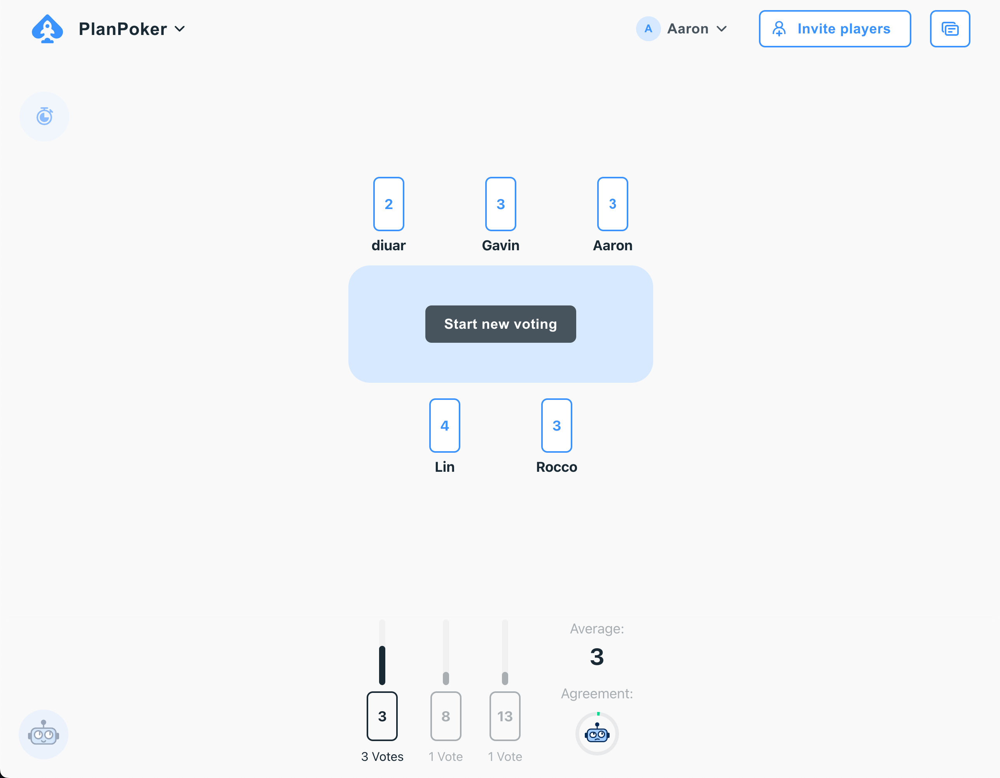

# K4 requiremensts verzameld omgezet naar userstories met acceptatiecriteria.

## Inleiding

In dit verslag bespreek ik het proces van het verzamelen van requirements en het omzetten ervan naar user stories met acceptatiecriteria. Dit proces vormt een essentieel onderdeel van de ontwikkeling van ons project en helpt bij het creëren van een duidelijk en uitvoerbaar plan dat aansluit bij de wensen en behoeften van de gebruiker.

## Requirements Verzamelen en Omzetten naar User Stories

De wensen en behoeften van de gebruiker, vastgelegd tijdens het "prototype making process", zijn omgezet naar user stories met duidelijke acceptatiecriteria. Dit proces is gedetailleerd beschreven in het bewijsmateriaal voor K2, dat te vinden is [hier](./K2.md). Tijdens dit proces hebben we vragen opgesteld en de resultaten gedocumenteerd. De vragen die we hebben gesteld zijn beschikbaar [hier](../../teamfiles/testing/gebruiker-test-script.md) en de bijbehorende resultaten zijn te vinden [hier](../../teamfiles/testing/gebruiker-test-resultaat.md).

De informatie verkregen van de gebruikers en de product owner vormde samen de basisrequirements voor de webshop. Deze requirements zijn vervolgens omgezet in user stories, waarbij elk teamlid verantwoordelijk was voor het opstellen van user stories (met acceptatiecriteria) op basis van de wireframes en prototypes die zij hadden gemaakt. Een voorbeeld van een user story kan gevonden worden [hier](https://gitlab.fdmci.hva.nl/propedeuse-hbo-ict/onderwijs/2023-2024/out-b-se-bim/blok-4/caaruujuuwoo65/-/work_items/77).

## Planning Poker

Om de gemaakte user stories te bespreken en te beoordelen, hebben we gebruikgemaakt van planning poker.

Tijdens deze sessies hebben we de volgende vragen gesteld om de user stories te evalueren:
1. Is de user story goed gedefinieerd en haalbaar binnen een dag?
2. Is de user story duidelijk geformuleerd? Kan het korter of mist er iets?
3. Zijn er meningsverschillen over de user story en de inhoud ervan?
4. Wat is de geschatte tijdsinvestering voor de user story?

Daarnaast ontdekten we dat sommige user stories anders geformuleerd waren maar dezelfde functionaliteit beoogden. Deze duplicaten hebben we gearchiveerd om verwarring te voorkomen.

Dit proces zorgde ervoor dat onze user stories goed doordacht, duidelijk geformuleerd en praktisch uitvoerbaar waren, wat essentieel is voor een succesvolle implementatie van ons project.