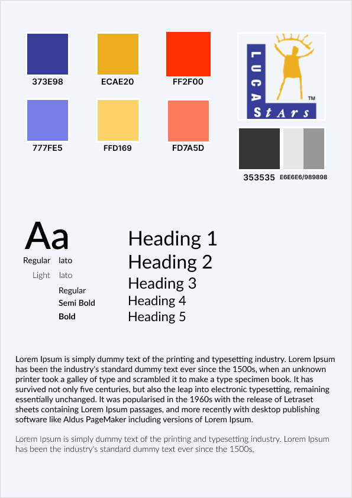

# K5

## Je legt per sprint de belangrijkste beslissingen, resultaten en inzichten van je UX/UI-ontwerp vast.

In het UX/UI-ontwerp van de webshop heb ik de volgende elementen behandeld:

    

        <strong>Wireframe</strong>
         
        
    

    

        <strong>Mockup</strong>
         
        
    

    

        <strong>Prototype</strong>
         
        
    

    

        <strong>Style Guide</strong>
         
        
    

Een duidelijk beeld van het uiteindelijke ontwerp is te zien in het volgende plaatje 

. 

Dit heb ik gebruikt als basis voor het maken van het UX/UI-ontwerp. Mijn bedoeling was om dit concept over te brengen aan mijn team. Hoewel ik tevreden ben met wat ik heb gemaakt, zie ik achteraf enkele fouten. Ik ben me hiervan bewust en zal deze inzichten meenemen naar toekomstige projecten.

## Style guide 
Een style guide in grafisch ontwerp van software is een document dat richtlijnen en standaarden bevat voor het ontwerp van een applicatie of website. Het doel van een style guide is om een consistente en cohesieve visuele ervaring te creëren. Het zorgt ervoor dat alle onderdelen van de software visueel op elkaar afgestemd zijn, wat bijdraagt aan een betere gebruikerservaring.

Het concept van een style guide was nieuw voor mij. Na onderzoek begreep ik dat een style guide veel meer is dan alleen een document met lettertypen of hex-kleuren. Het is verantwoordelijk voor het vastleggen van de algehele sfeer en uitstraling van de applicatie.

### Voordelen van een Style Guide

- **Consistentie**: Zorgt ervoor dat het ontwerp over alle schermen en onderdelen uniform blijft.
- **Efficiëntie**: Versnelt het ontwerpproces doordat ontwerpers niet elke keer opnieuw hoeven te beslissen over basiselementen.
- **Samenwerking**: Helpt verschillende teams, zoals ontwerpers en ontwikkelaars, om effectief samen te werken door duidelijke richtlijnen te bieden.
- **Merkidentiteit**: Versterkt de visuele identiteit en herkenbaarheid van het merk.

### Elementen van een Style Guide

1. **Kleurenpalet**:
   - Specifieke kleuren en hun toepassingen, inclusief hex- of RGB-codes.
   - Primaire, secundaire en tertiaire kleuren.

2. **Typografie**:
   - Voorgeschreven lettertypes en stijlen (bijv. vet, cursief).
   - Richtlijnen voor het gebruik van koppen, subkoppen, bodytekst en andere tekstsoorten.
   - Lettergroottes, regelhoogtes en spatiëring.

3. **Iconografie**:
   - Set van iconen die binnen de applicatie worden gebruikt.
   - Richtlijnen voor de grootte, stijl en consistent gebruik van iconen.

4. **Afbeeldingen en Illustraties**:
   - Stijl en toon van de afbeeldingen en illustraties.
   - Richtlijnen voor formaat, resolutie en plaatsing.

5. **Layout en Raster**:
   - Structuur en opbouw van pagina’s en schermen.
   - Gebruik van grids en marges om consistentie te waarborgen.

6. **Knoppen en Formulieren**:
   - Stijlen voor knoppen, inclusief kleur, grootte en vorm.
   - Richtlijnen voor formulieren, invoervelden en validatieberichten.

7. **Componenten en Widgets**:
   - Stijlen voor UI-componenten zoals menu’s, tabbladen, kaarten, modals, enz.
   - Beschrijvingen van interactiepatronen en gedragingen van componenten.

8. **Toon en Schrijfstijl**:
   - Richtlijnen voor de toon en stijl van geschreven content.
   - Voorbeelden van do’s en don’ts voor de tekstuele inhoud.

Een goed opgestelde style guide is een essentieel hulpmiddel voor het creëren van een professionele, gebruiksvriendelijke en visueel aantrekkelijke softwareapplicatie.

Naar mijn mening heeft de door mij gecreëerde style guide een minimalistisch karakter. Dit wordt mede bepaald door het bestaan van een reeds bestaand prototype. 