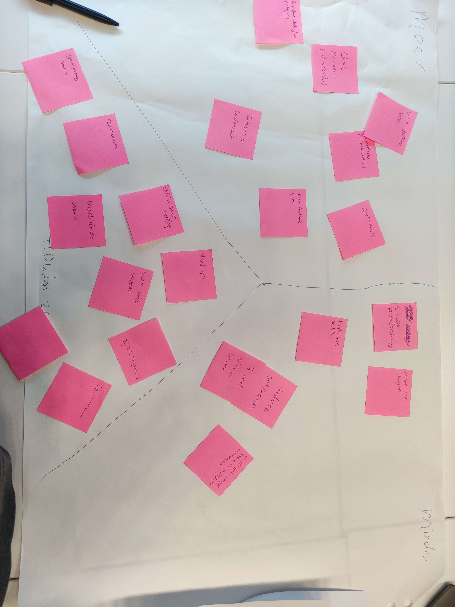

# Sprint Retrospective

*Disclaimer: Tijdens de retro was ik niet aanwezig, maar voor de rest van Sprint 1 deed ik mee met het team en was ik aanwezig tijdens de lessen.*

Na het doorlezen van de studiehandleiding over de retrospective, zag ik het volgende statement: "Het doel is om inzicht te krijgen in de werkwijze en te bepalen welke aspecten behouden moeten blijven en welke verandering nodig hebben."

Op basis van de todo-lijst in de studiehandleiding zijn er twee dingen die ik moet doen:

### Todo:
1. Je verzamelt feedback van minimaal twee medestudenten waarmee je hebt samengewerkt tijdens de afgelopen sprint.
2. Je schrijft een zelfreflectie waarin je jouw eigen ervaringen, prestaties en leerpunten van de afgelopen sprint bespreekt.

### Feedback van medestudenten
**Lin:** "Als je op tijd klaar bent met prototypes van de profielpagina, meer aandacht besteden aan de deadlines."

**Aaron:** "Meer focus op code I guess."

Ik heb het retro board toen doorgestuurd gekregen door @Aaron.

### Feedback van het team

**Meer doen:**
- Betere deadlines zetten
- Chatkanaal (Discord)
- Communicatie in user stories
  - *Gavin en ik hadden user stories gemaakt over hetzelfde onderwerp; we kwamen pas achter aan het eind van de scrum poker.*
- Meer tempo
- Meer feedback geven
- Afspraken duidelijk opschrijven
- Gebruikersonderzoek

**Minder doen:**
- Minder vage deadlines
- Minder rommelig gebruikersonderzoek
- Minder werk uitstellen
- Anderen ontkennen
- Minder veel kritiek leveren
- Minder belachelijk maken van onderzoeksonderwerpen

**Houden zo:**
- Stand up
- Onderzoek verslag
- Lekker werk verzetten
- Communicatie, kwam vaker voor
- Verschillende ideeën
- Sprintplanning maken, kwam vaker voor

### Mijn zelfreflectie

Tijdens deze sprint ben ik bezig geweest met het stellen van de onderzoeksvraag, deelvragen en de inleiding. Hier heb ik veel van geleerd, vooral omdat het constant formuleren en herformuleren een uitdaging bleek te zijn. Ook het maken van de style guide was iets nieuws voor mij, en ik heb gemerkt dat dit een belangrijk onderdeel is van het ontwikkelproces van de prototype.

Het constant evalueren en aanpassen van mijn werk heeft me laten inzien hoe belangrijk het is om flexibel te zijn en open te staan voor feedback. Dit was een waardevolle leerpunt voor mij, en ik besef nu dat goede communicatie en planning cruciaal zijn voor het succes van een project.

Ik neem de feedback van mijn teamleden serieus en ga kijken hoe ik deze kan toepassen in sprint 2. Concreet betekent dit dat ik beter op deadlines ga letten, meer focus ga leggen op de kern van de project (door o.a. meer tijd vrij te maken).
