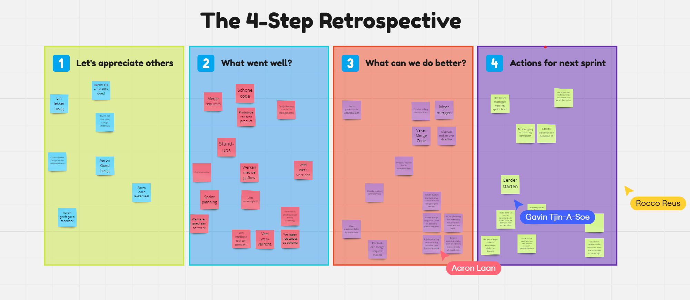

# Sprint Retrospective

## Een overzicht van ons retrospectief, de benoemde punten zijn samengevat:

### 1. Let's Appreciate Others:
Wat je kan zien is dat ik niets* heb toegevoegd aan het project en dit kan je "zien" aan de waardering van mijn team. 😔 Better luck next retro.

### 2. What Went Well?
- Er is veel werk verricht.
- Iedereen was aanwezig.

### 3. What Can We Do Better?
- We moeten vaker mergen.
- We moeten ons beter voorbereiden op de sprint review, inclusief de presentatie.
- We moeten rekening houden met onverwachte situaties.
- We moeten betere deadlines stellen.

### 4. Actions for Next Sprint?
- Deadlines stellen.
- De voortgang elke woensdag bevestigen, behalve in de week van de review, dan doen we de voortgang op maandag.

---

### Personal ToDo list:
- [x] Aanwezig zijn bij retro en review; op vrijdag moest ik na de les gelijk werken, waardoor ik de les online moest volgen. Dit was een belemmering, dus is het nu aangepast.
- [ ] De feedback voor deadlines is voormij bedoeld, gek genoeg hebben we geen deadline afgesproken;deadline afspreken.
- [ ] Eerder om hulp vragen; Als ontwikkelaar wil ik weten wanneer om hulp moet vragen en wanneer niet. 

    * Ik ben bezig geweest met het onderzoeksverslag en heb het veel complexer gemaakt dan nodig. Hierdoor heb ik het project uitgesteld tot het einde, waaruit bleek dat deel van de startscripts niet functioneel waren omdat de rest van het team op een Unix-omgeving werkt en ik als enige teamlid op een Windows-omgeving werk.
