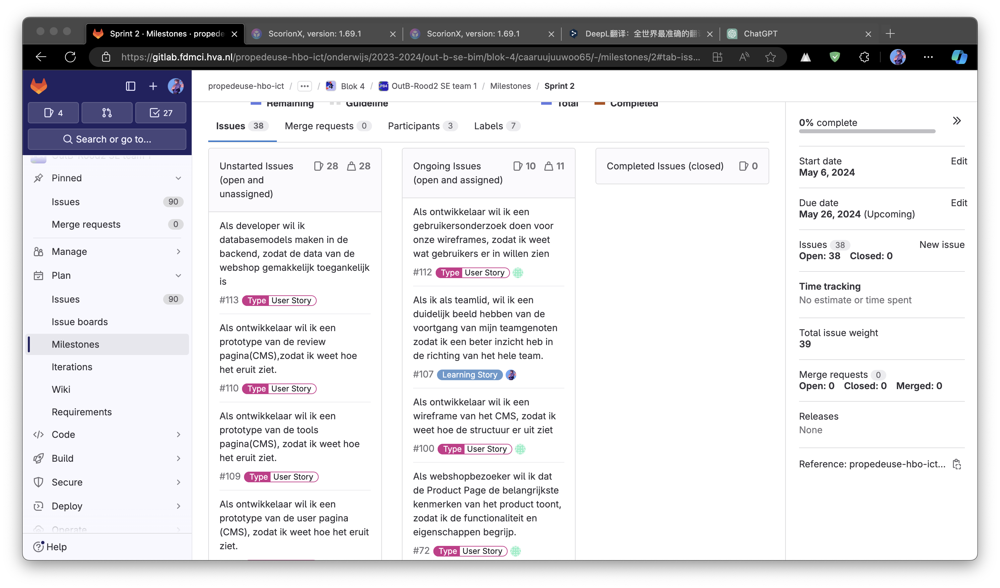
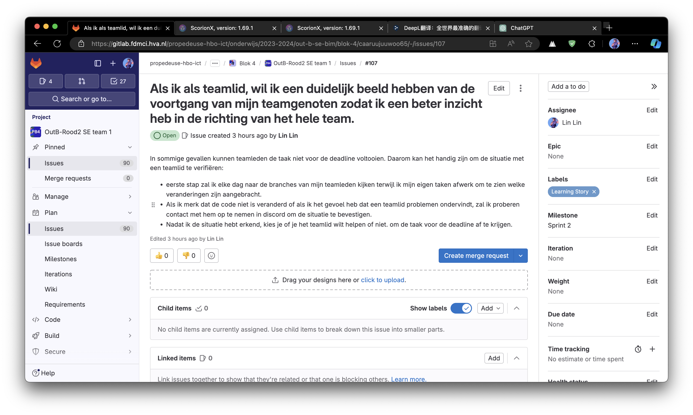
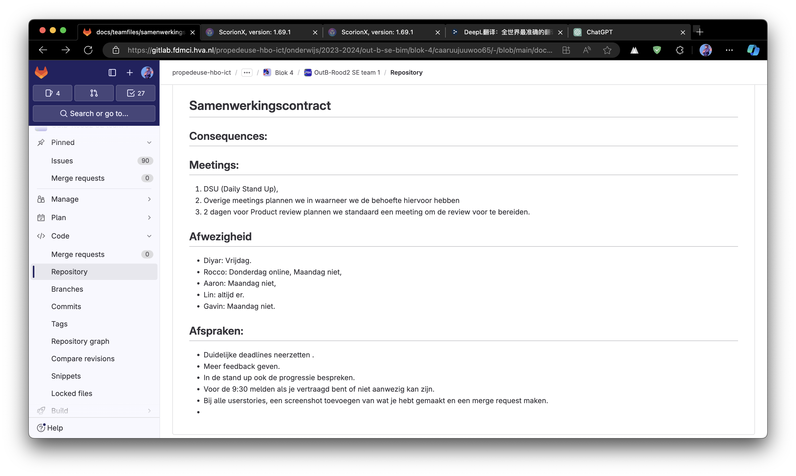

# Retro sprint 1

Onze groep heeft veel doelen bereikt in sprint 1, zoals het ontwerpen en produceren van wireframes en prototypes. Deze resultaten hebben we gepresenteerd in product review en we kregen goede feedback.

### Product Review

Een van de door de producteigenaar erkende workflows is dat één persoon in het team de eerste versie van het wireframe afmaakt en dat de andere teamleden vervolgens een prototype van het product maken op basis van dit ontwerp. Dit zorgt voor consistentie in het ontwerp.

De producteigenaar stelde ook enkele nieuwe eisen aan ons prototype, waaronder de mogelijkheid om toekomstige prijzen voor producten in te stellen. Daarnaast moest het mogelijk zijn voor klanten om alleen producten te beoordelen die ze hebben gekocht, en moest er de mogelijkheid zijn om de beoordelingen van klanten die het product meerdere keren hebben gekocht voorrang te geven boven andere beoordelingen.

Volgens het plan hebben we na de productbeoordeling een plan gemaakt voor de volgende sprint, waarbij het belangrijkste onderdeel was om het bestaande prototype om te zetten in daadwerkelijke code.

- [milestone](https://gitlab.fdmci.hva.nl/propedeuse-hbo-ict/onderwijs/2023-2024/out-b-se-bim/blok-4/caaruujuuwoo65/-/milestones/2#tab-issues)

### Reflecties op samenwerking

Tijdens deze sprint onderzocht ons team hoe efficiënt samen te werken, en in het eindresultaat heeft onze samenwerking het vooraf gestelde doel bereikt om het websiteontwerp en prototypeproduct voor de deadline af te ronden, maar we hebben enkele tekortkomingen in het proces gevonden.

Een van de situaties die zich voordeed tijdens het plannen van de taken was dat we voor elke taak een deadline hadden vastgesteld. Echter, tijdens de stand-up van de tweede week bleek dat teamleden hun taken niet hadden voltooid, wat resulteerde in het onvermogen om het verdere schema voort te zetten.

Dit had tot gevolg dat onze teamleden een extra dag moesten besteden aan het helpen voltooien van de taak. Op basis van deze situaties heb ik een oplossing bedacht, namelijk om de situatie met andere teamleden te bespreken om het probleem zo vroeg mogelijk op te lossen terwijl mijn eigen taak wordt voltooid.

Dus maakte ik een learning story voor mezelf in de volgende sprint :

- [learning story](https://gitlab.fdmci.hva.nl/propedeuse-hbo-ict/onderwijs/2023-2024/out-b-se-bim/blok-4/caaruujuuwoo65/-/issues/107)
  

We hebben ook ons samenwerking contract uitgebreid om ervoor te zorgen dat soortgelijke incidenten zich minder snel zullen voordoen.

- [samenwerking contract](https://gitlab.fdmci.hva.nl/propedeuse-hbo-ict/onderwijs/2023-2024/out-b-se-bim/blok-4/caaruujuuwoo65/-/blob/main/docs/teamfiles/samenwerkingscontract.md?ref_type=heads)

### Eindconclusie

Ik denk dat we in Sprint 1 ons beoogde doel hebben bereikt. Ik denk echter dat er meer gedetailleerde richtlijnen nodig zijn binnen het team op het gebied van teamwork, vooral om ervoor te zorgen dat elk teamlid zijn taken op tijd af heeft.