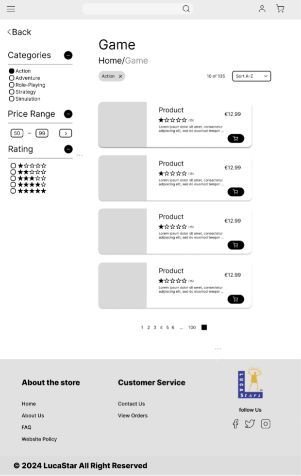
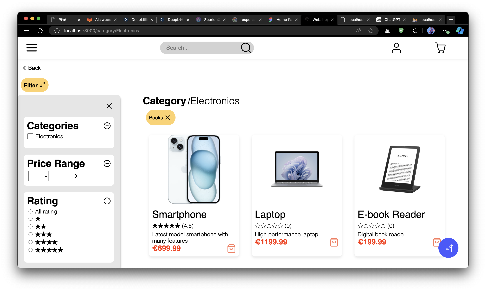
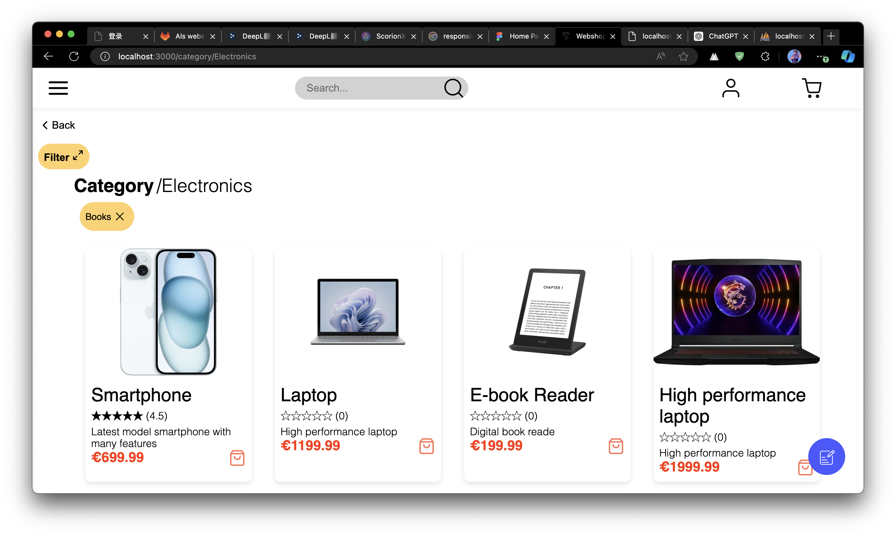
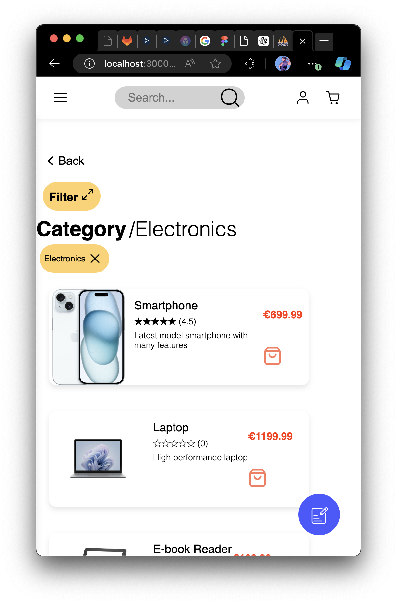

## Afgelopen sprint heb ik productoverzichtspagina's gemaakt op basis van prototype producten.

In [**userstories**](https://gitlab.fdmci.hva.nl/propedeuse-hbo-ict/onderwijs/2023-2024/out-b-se-bim/blok-4/caaruujuuwoo65/-/issues/29?work_item_iid=53) Voor de overzichtspagina gelden twee vereisten. Ten eerste moet de pagina minimaal een filtersectie en een productenlijst bevatten. Ten tweede moet de pagina een responsive lay-out hebben.

Ik heb het prototype gemaakt op basis van de vereisten en kreeg de volgende feedback

- De filtersectie kan volledig worden verborgen om meer productinformatie te tonen.
- Aan de desktopkant zou de productlay-out een horizontale lay-out kunnen gebruiken, zodat er meer producten op een rij kunnen worden weergegeven.

Ik heb hun suggesties opgevolgd en uiteindelijk de wijzigingen aan de voorkant doorgevoerd.

## Hier is een vergelijking van het prototype en de webpagina:

**_Dit is het prototype van de overviewspagina. ↓_**

**_Dit is de overviewspagina met het filter ↓_**

_**Dit is de overzichtspagina, die het filter verbergt ↓**_

## In de mobiele lay-out heb ik een verticale lay-out gebruikt.
Zodat elk weergegeven productgebied groter is, en gebruikers nauwkeuriger op producten kunnen klikken op hun mobiele apparaten.

