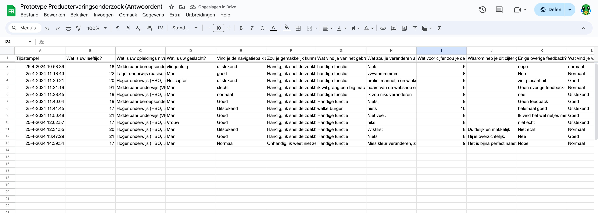
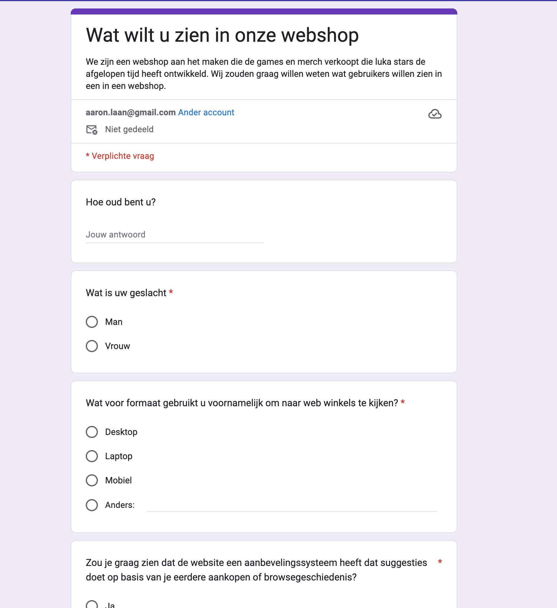

# K2 en K5 Bewijs
In Sprint 1 hebben we een aantal prototypes gemaakt van de pagina's op de webshop voor Luka Stars. Nadat we aan het begin van de sprint onze taken hadden verdeeld en een goed idee hadden gekregen van wat er ongeveer gemaakt moest worden, zijn we begonnen met het maken van prototypes. Deze hebben we gemaakt in [Figma](https://www.figma.com/file/gqhLU9HQsAIBpbBxSBsnxe/Home-Page?type=design&node-id=0-1&mode=design&t=crpjRXoIFqrXJnUC-0). Ook hebben we interactieve elementen toegevoegd, zodat gebruikers binnen Figma kunnen klikken voor een interactieve ervaring.

De prototypes die we hebben gemaakt zijn:
- Login pagina 
- Register pagina 
- Home pagina 
- Product overzicht pagina 
- Winkelwagen pagina
- Categorie pagina
- Product detail pagina 
- Product review pagina
- Account pagina 
- Side menu
- Navbar
- Footer

Na het maken van de prototypes heb ik een [test script](../../teamfiles/testing/prototype-test-script.md) opgesteld en deze omgezet naar Google Docs. Vervolgens hebben we dit naar een aantal potentiele gebruikers gestuurd om hun feedback te krijgen. De ontvangen feedback hebben we [verwerkt](../../teamfiles/testing/prototype-test-resultaat.md) en we willen deze meenemen in de backlog van sprint 2.

Voor het maken van de prototypes hebben we een gebruikersonderzoek uitgevoerd om erachter te komen wat voor soort gebruikers we kunnen verwachten en welke features ze graag zouden willen zien, naast de functionaliteiten die we van Luka Stars hebben gekregen. De vragen die we hebben gesteld, zijn [hier](../../teamfiles/testing/gebruiker-test-script.md) te vinden en de bijbehorende resultaten zijn [hier](../../teamfiles/testing/gebruiker-test-resultaat.md) te vinden. We hebben de resultaten van dit onderzoek ook meegenomen in de backlog van sprint 2.

Deze documenten zijn belangrijk voor ons project, omdat ze ons helpen om de webshop zo goed mogelijk af te stemmen op de wensen van de gebruikers. We willen ervoor zorgen dat de webshop gebruiksvriendelijk is en dat gebruikers gemakkelijk kunnen vinden wat ze zoeken. Daarom is het belangrijk om feedback te krijgen van potentiele gebruikers en om te weten wat voor soort gebruikers we kunnen verwachten. 

## STARR
Situatie:
In Sprint 1 van ons project voor de webshop Luka Stars hebben we prototypes van verschillende pagina's gemaakt. Dit was nadat we in het begin van de sprint onze taken hadden verdeeld en een duidelijk beeld hadden gekregen van wat er precies gemaakt moest worden.

### Taak:
Mijn taak was om de prototypes te maken en een testscript op te stellen voor de prototype en gebruikerstests. Daarnaast moest ik ervoor zorgen dat we feedback kregen van potentiele gebruikers en dat deze feedback verwerkt werd voor de volgende sprint.

### Actie:
We begonnen met het maken van prototypes in [Figma](https://www.figma.com/design/gqhLU9HQsAIBpbBxSBsnxe/Home-Page?node-id=0-1&t=kedyGAxL2rKehBz4-0), waarbij we interactieve elementen toevoegden om een duidelijk beeld te bieden van de applicatie. De gemaakte prototypes waren de login pagina, register pagina, home pagina, product overzicht pagina, winkelwagen pagina, categorie pagina, product detail pagina, product review pagina, account pagina, side menu, navbar, en footer.

Na het maken van een aantal van de prototypes, stelde ik een testscript op, zette dit om naar Google Docs en stuurde het naar potentiële gebruikers voor feedback. De ontvangen feedback werd vervolgens verwerkt en meegenomen in de backlog van Sprint 2.

We voerden ook een gebruikersonderzoek uit om inzicht te krijgen in de wensen van onze gebruikers. De vragen die we stelden, zijn [hier](../../teamfiles/testing/gebruiker-test-script.md) te vinden en de resultaten [hier](../../teamfiles/testing/gebruiker-test-resultaat.md). Deze resultaten zijn meegenomen in de backlog van Sprint 2.

Ook hebben we een prototype test uitgevoerd om feedback te krijgen van potentiele gebruikers op onze designs zelf. De vragen die we stelden, zijn [hier](../../teamfiles/testing/prototype-test-script.md) te vinden en de resultaten [hier](../../teamfiles/testing/prototype-test-resultaat.md).

### Resultaat:
De prototypes boden een duidelijk beeld van hoe de uiteindelijke webshop eruit zou komen te zien. Door de feedback van gebruikers hebben we inzicht gekregen die ons hielpen de webshop beter af te stemmen op de wensen en behoeften van de gebruikers. De verzamelde feedback en gebruikersonderzoeken en prototype zijn mooi geweest voor het verbeteren van de gebruiksvriendelijkheid en functionaliteit van de webshop.

### Reflectie:
Het gebruik van Figma en het betrekken van potentiele gebruikers was waardevol. Het stelde ons in staat om mogelijke problemen met de designs te identificeren en aan te pakken. Door goed onderzoek te doen, hebben

we een beter begrip gekregen van de gebruikersbehoeften, wat leidde tot een meer doordachte en gebruikersvriendelijke webshop.

### Toekomst:
In toekomstige sprints ben ik van plan de feedback van gebruikers te blijven ophalen en deze toe te passen. Ik zal ook blijven werken met interactieve prototypes en gedetailleerde test scripts. Daarnaast zal ik ervoor zorgen dat we consistent gebruikersonderzoek uitvoeren om inzicht te krijgen in veranderende gebruikersbehoeften en trends.

## Foto's
### Figma overzicht:

### prototype google docs resultaat in ruwe data:

### gebruiker test analytics

### gebruiker onderzoek formulier

### prototype onderzoek analytics

### prototype onderzoek formulier

### Register:

### Login:

## Links:
- [Prototype test script](../../teamfiles/testing/prototype-test-script.md)
- [Prototype test resultaat](../../teamfiles/testing/prototype-test-resultaat.md)
- [Prototype test data](https://docs.google.com/spreadsheets/d/1PKp6tdSQldpN2XzpXqt-qkCITgruwVLRfKsvFP-XaXc/edit?resourcekey#gid=1809565716)
- [Gebruiker test script](../../teamfiles/testing/gebruiker-test-script.md)
- [Gebruiker test resultaat](../../teamfiles/testing/gebruiker-test-resultaat.md)
- [Figma overzicht](https://www.figma.com/file/gqhLU9HQsAIBpbBxSBsnxe/Home-Page?type=design&node-id=0%3A1&mode=design&t=crpjRXoIFqrXJnUC-1)
- [Figma interactief](https://www.figma.com/proto/gqhLU9HQsAIBpbBxSBsnxe/Home-Page?type=design&node-id=1-3&t=A4NXZv8ROMuvWasy-0&scaling=min-zoom&page-id=0%3A1&starting-point-node-id=1%3A3&show-proto-sidebar=1)
- [Gebruiker test form](https://forms.gle/z4W8XWrCFwjHf72y5)
