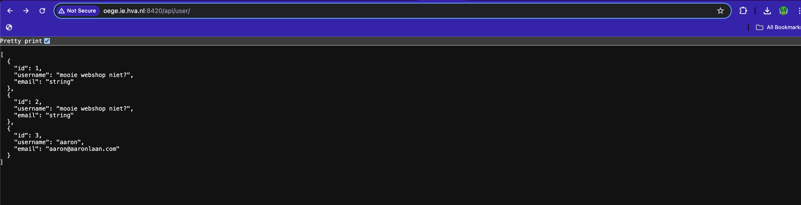
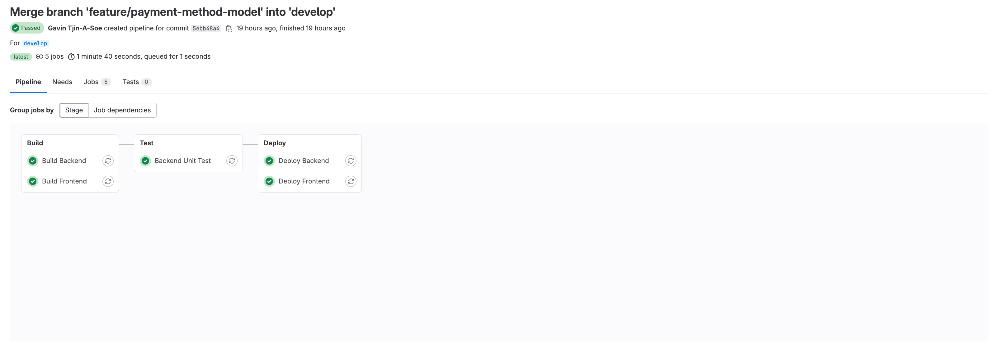
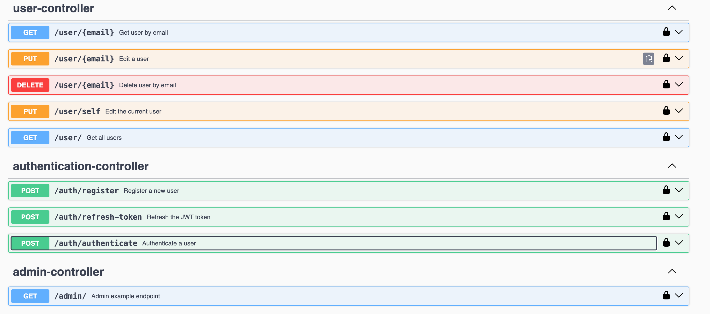
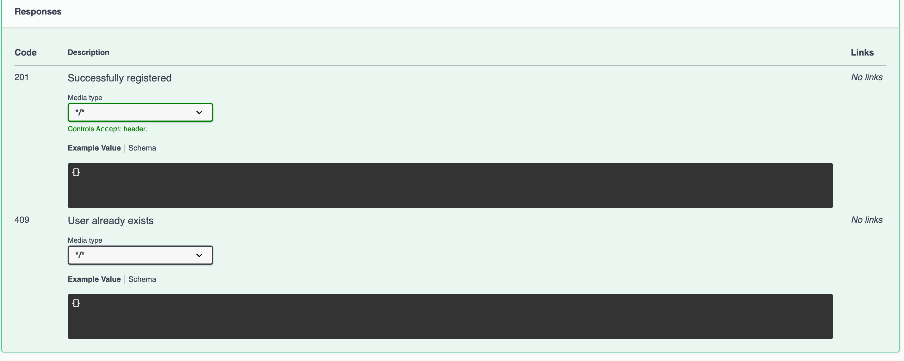
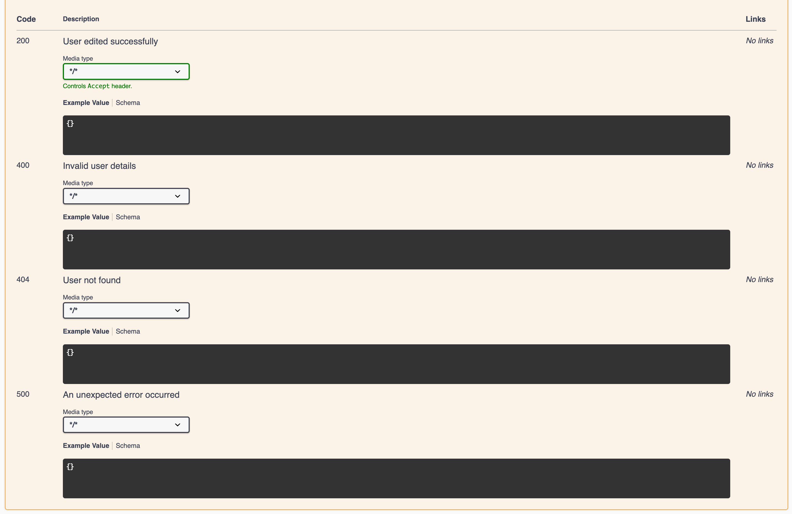
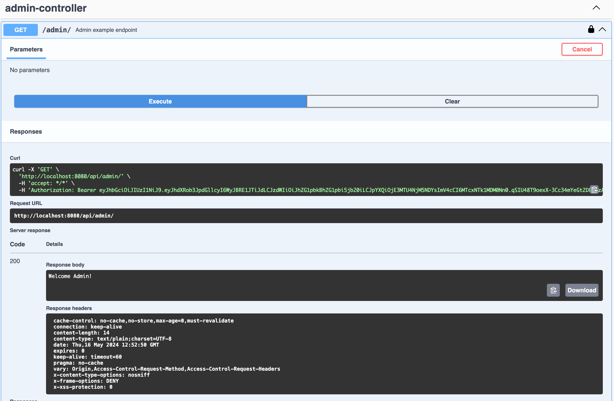
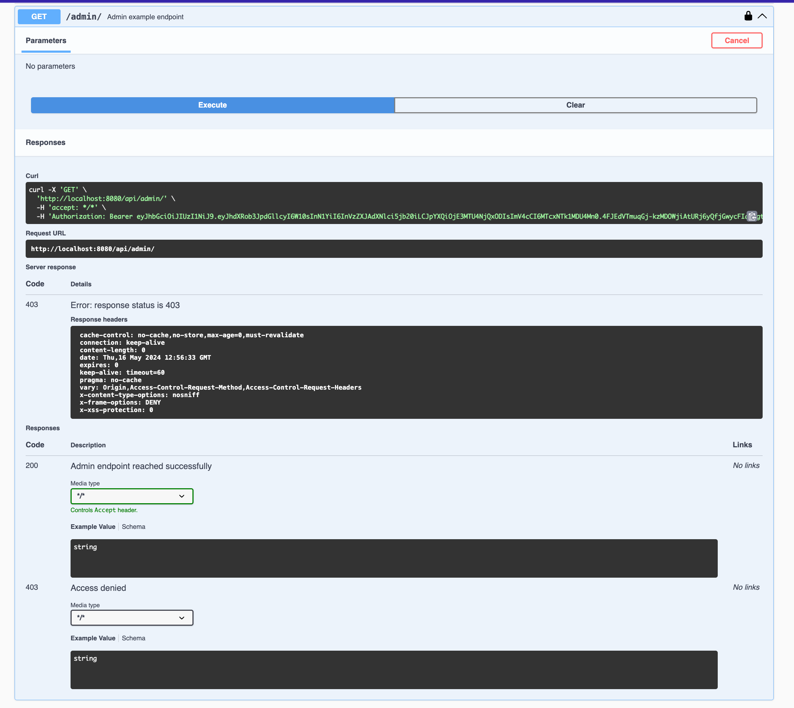

# K3
Omdat wij in blok 4 springboot zijn gaan gebruiken moest we de manier hoe we dingen deployde herzien, aangezien de hbo-ict-cloud een bundeled JS verwacht konden we onze backend hier niet meer deployen.

Na een beetje uitzoek werk hebben we besloten om hem te deployen op [oege](https://oege.ie.hva.nl/registratie/), dit is een server van de opleiding waar studenten hun projecten kunnen deployen. Dit was een goede oplossing aangezien we daar ook SSh toegang hadden in plaats van enkel een geimiteerde SFTP die aanwezig is op de hbo-ict-cloud.

Eerst had ik een aantal dingen geprobeerd, maar ik liep er steeds tegen aan dat ik geen root toegang had, uiteindelijk was het ene dat werkte de meest simpele optie, we hebben een jar file gemaakt en deze op de server gezet. Vervolgens hebben we een script aangemaakt en de jar file gestart. Dit was alles wat we moesten doen om de backend te deployen.



Voor de front-end en database maken wij nog wel gebruik van de hbo-ict cloud, voor het deployen van de front-end en backend hebben wij een aparte pipeline job, en de omgevingen worden nu gedeployed naar een development en productie omgeving.



De development omgeving is bedoeld voor het testen van nieuwe features en de productieomgeving is bedoeld voor de eindgebruiker. De productie omgeving is ook de omgeving die wij gebruiken voor de demo's.

Verder maken wij ook gebruik van geautomatiseerde tests, deze tests worden uitgevoerd wanneer er een commit word gedaan. Dit is vooral belangerijk bij het maken van een merge request, zo kun je zien of er mogelijk (onverwachts) nog dingen fout gaan na de gemaakte aanpassingen.

Voorbeeld van een simpele test die wordt uitgevoerd voor het inloggen:

PS: De comments zijn hier in het nederlands voor dit formulier, ik hoef niet opgesloten te worden :D
```java
        @Test
        public void testAuthenticate() throws Exception {
            JwtRequest jwtRequest = new JwtRequest(userDto.getEmail(), userDto.getPassword()); // Maak het model dat wordt verstuurd.

            MvcResult mvcResult = mockMvc.perform(post("/auth/authenticate")
                    .contentType(MediaType.APPLICATION_JSON)
                    .content(objectMapper.writeValueAsString(jwtRequest)))
                .andExpect(status().isOk()) // Check of het endpoint status OK (200) terug geeft. 
                .andReturn();
            
            String responseBody = mvcResult.getResponse().getContentAsString();
            JsonNode responseJson = new ObjectMapper().readTree(responseBody);

            // Haal de access en refresh tokens op.
            String accessToken = responseJson.get("access_token").asText();
            String refreshToken = responseJson.get("refresh_token").asText();
            
            // Faal de test als de jwt token en/of refresh token leeg of null zijn.
            assertNotNull(accessToken);
            assertFalse(accessToken.isEmpty());
            assertNotNull(refreshToken);
            assertFalse(refreshToken.isEmpty());
        }
```

Verder maken wij ook gebruik van swagger om ons project te helpen documenteren, Zo kunnen onze teamgenoten makkelijk zien welke endpoints er zijn, welke parameters ze moeten meegeven en wat ze kunnen verwachten als resultaat. Dat is erg handig om snel te testen of de endpoints werken zoals verwacht.

Hier een voorbeeld van een overzicht van de endpoints in swagger:


Voorbeelden van de gedocumenteerde response van een endpoint:



Verder hebben wij nog een aantal extra features toegevoegd, zoals een refresh token, dit token kan worden gebruikt om een nieuwe access token te krijgen zonder dat de gebruiker elke keer opnieuw hoeft in te loggen. Dit is vooral handig voor de gebruiker, omdat het de gebruikerservaring verbeterd. En het is ook veiliger omdat de access token maar een korte tijd geldig is.

Daarnaast hebben wij ook rollen toegevoegd, dit is handig voor de admin, omdat de admin meer rechten heeft dan een normale gebruiker. Zo kan de admin bijvoorbeeld de rollen van gebruikers aanpassen terwijl een normale gebruiker dit niet kan. Dit is vooral handig voor de veiligheid van de applicatie, omdat je niet wilt dat iedereen zomaar alles kan doen.

Demo van de rollen met voorbeeld nep json:


```json
{
    "email": "admin@admin.com",
    "password": "***",
    "role": "ADMIN"
}
```


```json
{
    "email": "user@user.com",
    "password": "***",
    "role": "USER"
}
```

