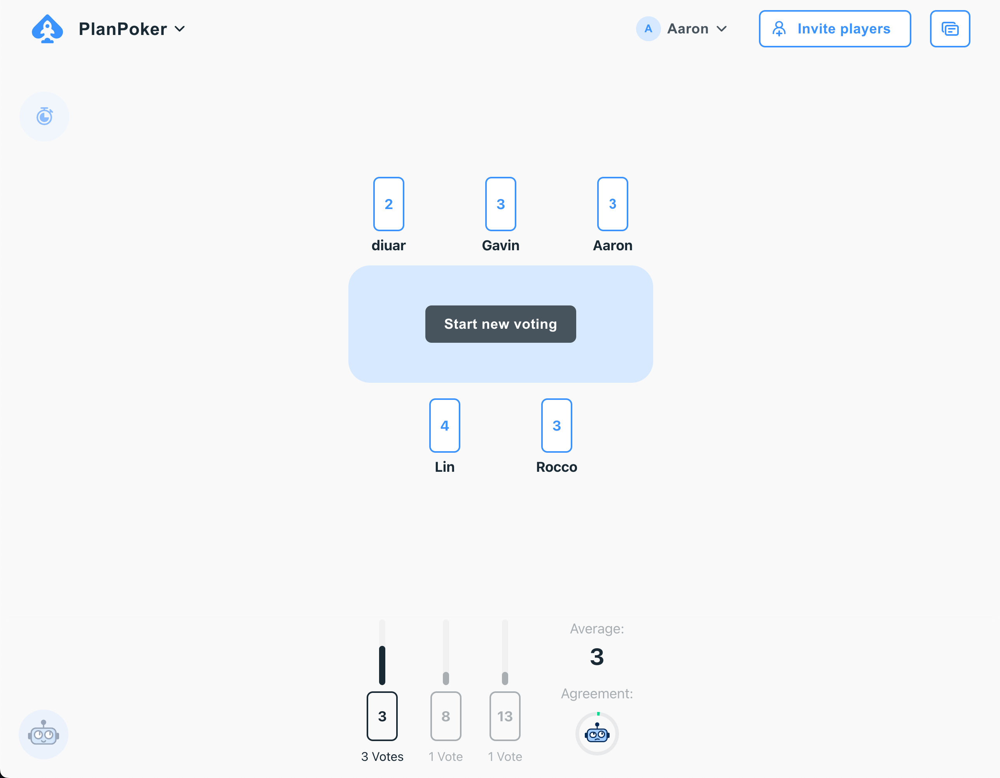
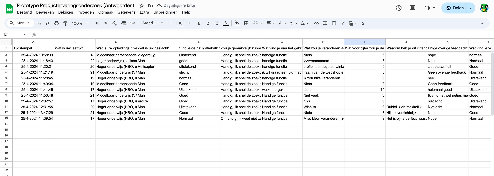
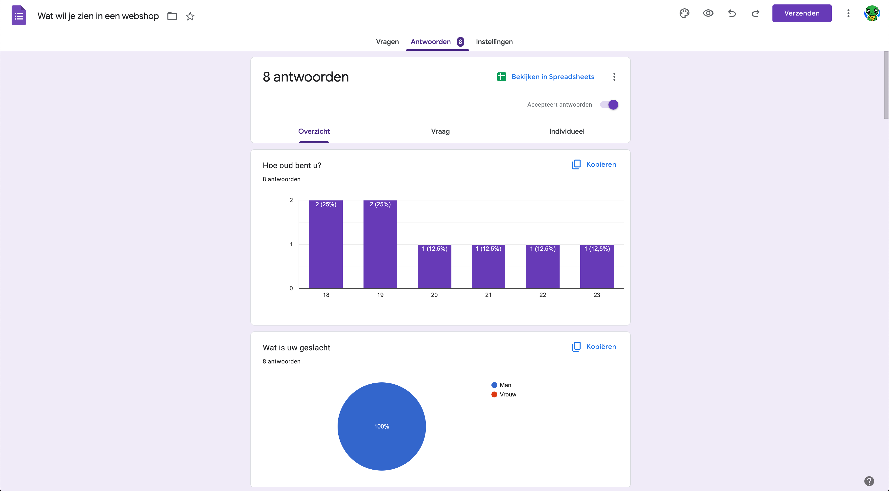
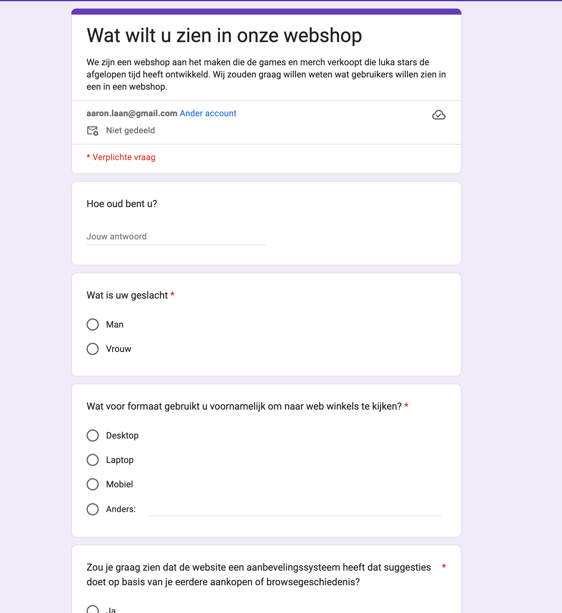

# K4
In sprint 1 hebben wij (potentiele) gebruikers een formulier laten invullen om een idee te krijgen van wat voor soort gebruikers we kunnen verwachten en wat voor features ze graag zouden willen zien. De vragen die we hebben gesteld, zijn [hier](../../teamfiles/testing/gebruiker-test-script.md) te vinden en de bijbehorende resultaten zijn [hier](../../teamfiles/testing/gebruiker-test-resultaat.md) te vinden. Op basis van deze resultaten en de informatie die we hebben gekregen van de "product owner" die al in het project stond hebben alle leden van ons team een aantal user-stories met acceptatie criteria aangemaakt, bijvoorbeeld [deze](https://gitlab.fdmci.hva.nl/propedeuse-hbo-ict/onderwijs/2023-2024/out-b-se-bim/blok-4/caaruujuuwoo65/-/work_items/45). 

Verder hebben wij ook plan poker gedaan om al onze user-stories een gewicht te geven, zodat we een beter beeld hebben van hoeveel werk er in de sprint zit, en of er mogelijke mening verschillen zijn in het aantal werk dat een user-story kost. Hieronder is een afbeelding te zien van onze planning poker sessie.

Ook hebben we potentiele gebruikers laten kijken naar onze prototypes door middel van google forms, door dit te doen hebben we feedback kunnen ophalen en een beter idee gekregen van wat de gebruikers precies willen zien. De vragen die we hebben gesteld, zijn [hier](../../teamfiles/testing/prototype-test-script.md) te vinden en de bijbehorende resultaten zijn [hier](../../teamfiles/testing/prototype-test-resultaat.md) te vinden. 

### Foto's
#### Planning poker

### prototype google docs resultaat in ruwe data:

### gebruiker test analytics

### gebruiker onderzoek formulier

### gebruiker onderzoek analytics

### gebruiker onderzoek formulier

### Voorbeeld issue

## Links
- [Gebruiker test script](../../teamfiles/testing/gebruiker-test-script.md)
- [Gebruiker test resultaat](../../teamfiles/testing/gebruiker-test-resultaat.md)
- [Prototype test script](../../teamfiles/testing/prototype-test-script.md)
- [Prototype test resultaat](../../teamfiles/testing/prototype-test-resultaat.md)
- [Prototype test data](https://docs.google.com/spreadsheets/d/1PKp6tdSQldpN2XzpXqt-qkCITgruwVLRfKsvFP-XaXc/edit?resourcekey#gid=1809565716)
- [Figma overzicht](https://www.figma.com/file/gqhLU9HQsAIBpbBxSBsnxe/Home-Page?type=design&node-id=0%3A1&mode=design&t=crpjRXoIFqrXJnUC-1)
- [Figma interactief](https://www.figma.com/proto/gqhLU9HQsAIBpbBxSBsnxe/Home-Page?type=design&node-id=1-3&t=A4NXZv8ROMuvWasy-0&scaling=min-zoom&page-id=0%3A1&starting-point-node-id=1%3A3&show-proto-sidebar=1)
- [Gebruiker test form](https://forms.gle/z4W8XWrCFwjHf72y5)
- [User-story](https://gitlab.fdmci.hva.nl/propedeuse-hbo-ict/onderwijs/2023-2024/out-b-se-bim/blok-4/caaruujuuwoo65/-/work_items/45)
- [Planning poker](../../teamfiles/pictures/planning-poker.png)

