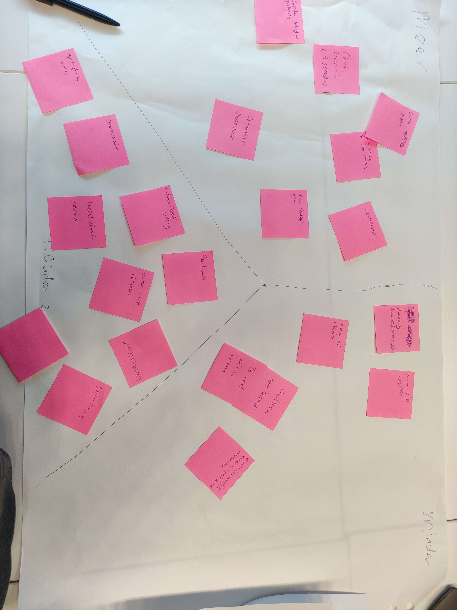

# Retro sprint 1

## Reflectie op leerdoelen sprint 1:
## [Ik wil leren hoe je springboot deployed op een productie omgeving, specifiek op oege](https://gitlab.fdmci.hva.nl/propedeuse-hbo-ict/onderwijs/2023-2024/out-b-se-bim/blok-4/caaruujuuwoo65/-/issues/103):

### Situatie: 
Ik heb redelijke kennis van het deployen van projecten, maar ik heb nog geen ervaring met het implementeren van een Spring Boot applicatie op een productieomgeving in oege, ik wil hier meer over leren.

### Taak: 
Ik heb als specifiek doel gesteld om binnen één sprint te leren hoe ik een Spring Boot applicatie implementeer op een productieomgeving met oege.

### Actie: 
Ik heb oege succesvol opgezet en de benodigde stappen gevolgd om een Spring Boot applicatie op oege te deployen. Ik heb gebruikgemaakt van mijn kennis die ik heb opgedaan bij het deployen van andere projecten over de jaren, ik kon helaas geen hva documentatie raadplegen aangezien deze niet bestaat voor het deployen van java projecten binnen oege, uitendelijk ben ik er zelf achter gekomen door het internet te raadplegen over manieren om een java project te runnen op een server zonder root toegang.

### Resultaat: 
Ik heb mijn doel binnen de gestelde tijdslimiet van één sprint bereikt. Ik heb niet alleen de Spring Boot-toepassing succesvol geïmplementeerd, maar heb ook meer geleerd over de oege-omgeving en het gebruik van SSH om op linux servers te werken.

### Reflectie: 
Ik wist van tevoren al dat er geen documentatie voor het deployen van een java project was vanuit de hva, dus ik had verwacht dat dit nogal een uitdaging zou zijn, voornamelijk omdat je in de server ook geen root toegang hebt. Maar Ik vond het opzetten van onze productieomgeving op oege verrassend eenvoudig, maar ook leerzaam. Eerst moest ik nogal zoeken, maar uiteindelijk kwam ik er vrij snel uit. Ik heb veel geleerd over het werken op linux servers via SSH en heb een beter begrip gekregen van het implementeren van projecten op een productieomgeving.

### Foto's:

## [Ik wil de basisprincipes begrijpen en kunnen toepassen van het opzetten van een Spring Boot-project](https://gitlab.fdmci.hva.nl/propedeuse-hbo-ict/onderwijs/2023-2024/out-b-se-bim/blok-4/caaruujuuwoo65/-/issues/102):

### Situatie:
ik ben bezig geweest met het leren hoe je een springboot applicatie opzet, inclusief het opzetten van services, controllers, repositories, Swagger en een ORM, voel ik dat mijn begrip van de basisprincipes van Spring Boot nog moet worden verbeterd. Ik besef dat een mooi begrip van Spring Boot belangrijk is voor ons project en wil daarom mijn kennis verder verbeterenn.

### Taak: 
Ik wil de basisprincipes begrijpen en kunnen toepassen bij het opzetten van een Spring Boot-project.

### Actie: 
Ik heb mij gericht op het leren van de basisprincipes van Spring Boot door te kijken naar documentatie. Ik heb dit gedaan door een basis opzet voor ons Spring Boot-project die een werkende REST API implementeert te maken.

### Resultaat:
Binnen sprint 1 ben ik erin geslaagd om een eenvoudig Spring Boot-project op te zetten. Mijn begrip van de basisprincipes van Spring Boot is aanzienlijk verbeterd, en ik voel me zelfverzekerder in mijn vermogen om dit toe te passen in ons project.

### Reflectie: 
Het afronden van dit SMART doel heeft mij meer vetrouwen gegeven in mijn vermogen om dit framework te gebruiken. Ook was ik positief verrast door hoe fijn springboot werkte. Ik was natuurlijk al best wel bekend met java, maar tot nu toe denk ik dat het kiezen voor springboot voor dit project een goeie keuze is geweest.

### Link's
link naar merge request voor de springboot implementatie: [hier](https://gitlab.fdmci.hva.nl/propedeuse-hbo-ict/onderwijs/2023-2024/out-b-se-bim/blok-4/caaruujuuwoo65/-/merge_requests/1)

## Leerdoelen sprint 2:
- [Smart doel 1 - Ik wil graag leren hoe ik rollen implementeer in mijn applicatie om gebruikers te authorizeren](https://gitlab.fdmci.hva.nl/propedeuse-hbo-ict/onderwijs/2023-2024/out-b-se-bim/blok-4/caaruujuuwoo65/-/issues/115)
- [Smart doel 2 - Ik wil graag leren hoe ik jwt authenticatie opzet in springboot](https://gitlab.fdmci.hva.nl/propedeuse-hbo-ict/onderwijs/2023-2024/out-b-se-bim/blok-4/caaruujuuwoo65/-/issues/114)

## Aangepaste team contract:
### Aanpassingen:
- We hebben afgesproken om een demo meeting te houden 2 dagen voor de product review, zodat we onze voortgang kunnen bespreken en elkaar onze afgemaakte user-stories laten zien.
- We hebben afgesproken om bij alle user-stories een screenshot toe te voegen van wat je hebt gemaakt en een merge request te maken.
- We hebben afgesproken om duidelijke deadlines neer te zetten.

### Link:
- [Team contract](../../teamfiles/samenwerkingscontract.md)

## Retro bord:

## Sprint 2 backlog:
We hebben hebben een aantal user stories toegevoegd aan de sprint 2 backlog. Sommige user stories zijn gebaseerd op de feedback die we hebben ontvangen van de product owner en de resultaten van de gebruikerstesten. De meeste user stories zijn gericht op het implementeren van nieuwe features, de meeste van deze user-stories hadden we vorige sprint al gemaakt en weights toegewezen met planning poker, met het idee dat we die in sprint 2 gingen oppakken. Hierdoor werd het makkelijker om de sprint 2 backlog te vullen.

Wij zoeken nog wel een mooie manier om in de milestones mensen toe te wijzen aan user stories, zodat we makkelijker kunnen zien wie waar mee bezig is. Aangezien gitlab automatisch toegewezen user stories aanwijst als "in progress". Hier moeten wij nog even naar kijken, we zitten er aan te denken om een label toe te voegen aan de user stories die wel toegewezen maar niet in progress zijn. (suggesties zijn welkom! :D)

### Foto's:

### Link:
- [Sprint 2 backlog](https://gitlab.fdmci.hva.nl/propedeuse-hbo-ict/onderwijs/2023-2024/out-b-se-bim/blok-4/caaruujuuwoo65/-/milestones/2#tab-issues)
