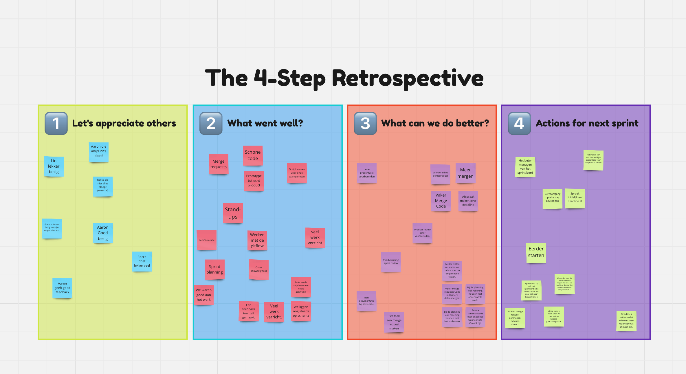

# Retrospective sprint 2

## Reflectie op leerdoelen sprint 2:

### [Smart doel 1 - Ik wil graag leren hoe ik rollen implementeer in mijn applicatie om gebruikers te authorizeren](https://gitlab.fdmci.hva.nl/propedeuse-hbo-ict/onderwijs/2023-2024/out-b-se-bim/blok-4/caaruujuuwoo65/-/issues/115)

### Situatie: 
Ik werkte aan onze Spring Boot applicatie en realiseerde me dat ik gebruikersrollen moest implementeren om de toegang tot specifieke delen van de applicatie te beheren. Dit was cruciaal voor de veiligheid en beveiliging van onze app.

### Taak: 
Mijn specifieke taak was om te leren hoe ik rollen kon toewijzen aan gebruikers en deze rollen kon gebruiken om toegangscontrole in te stellen voor verschillende functies en endpoints.

### Actie: 
Om dit doel te bereiken, heb ik de volgende stappen ondernomen:
- **Bestuderen van hoe rollen worden geimplementeerd**: Ik heb tijd besteed aan het begrijpen van autorisatie en rollen in Spring Boot, door te kijken hoe dit in andere projecten wordt gedaan. Ik heb geleerd hoe rollen kunnen worden gedefinieerd en toegewezen aan gebruikers.
- **Implementatie van rollen**: Ik heb de rollenimplementatie in mijn applicatie toegepast. Ik heb rollen gedefinieerd, zoals “ADMIN” en “USER”.
- **Endpointbeveiliging**: Ik heb endpoints beveiligd op basis van gebruikersrollen. Bijvoorbeeld, alleen gebruikers met de rol “ADMIN” hebben toegang tot het feedback gedeelte van de applicatie.

### Resultaat: 
Het resultaat was dat ik succesvol rollen heb geimplementeerd in onze applicatie. Gebruikers hebben nu verschillende niveaus van toegang op basis van hun rol.

### Reflectie: 
Ik ben tevreden met het resultaat, het implementeren van de rollen was minder moeite dan ik had verwacht aangezien dit spring security hier goeie hulpmiddelen voor heeft. Maar het is wel een erg belangrijk onderdeel van de applicatie, dus ik ben blij dat ik dit doel heb bereikt.

### Links:
[Link naar merge request voor de rollen implementatie](https://gitlab.fdmci.hva.nl/propedeuse-hbo-ict/onderwijs/2023-2024/out-b-se-bim/blok-4/caaruujuuwoo65/-/merge_requests/6)

### [Smart doel 2 - Ik wil graag leren hoe ik jwt authenticatie opzet in springboot](https://gitlab.fdmci.hva.nl/propedeuse-hbo-ict/onderwijs/2023-2024/out-b-se-bim/blok-4/caaruujuuwoo65/-/issues/114)
### Situatie: 
We willen graag gebruikers authenticeren met behulp van JWT (JSON Web Tokens) om toegang te geven tot beveiligde endpoints.

### Taak: 
Mijn specifieke taak was om te leren hoe ik JWT authenticatie kon implementeren en dit vervolgens toe te passen in mijn Spring Boot applicatie.

### Actie:
- **Bestuderen van JWT**: Ik heb tijd besteed aan het begrijpen van JWT en hoe het werkt. Ik heb andere projecten en documentatie geraadpleegd om mijn kennis op te bouwen.
- **Integratie in Spring Boot**: Ik heb de nodige stappen ondernomen om JWT gebasseerde authenticatie te integreren in mijn Spring Boot applicatie. Specifiek het configureren van Spring Security en het genereren en valideren van JWT’s.
- **Beveiligde endpoints**: Ik heb beveiligde endpoints aangemaakt waarvoor gebruikers een geldige JWT moeten hebben om toegang te krijgen.

### Resultaat: 
Het resultaat was dat onze Spring Boot applicatie nu gebruik maakt van JWT voor authenticatie. Gebruikers kunnen alleen toegang krijgen tot beveiligde endpoints als ze een geldige JWT hebben.

### Reflectie: 
Ik voel me tevreden met het resultaat, ook dit was makkelijker dan ik had verwacht omdat spring security hier goeie hulpmiddelen voor heeft. Het gebruik van JWT zal de algehele beveiliging van onze applicatie verbeteren.

### Links:
[Link naar merge request voor de jwt_authenticatie](https://gitlab.fdmci.hva.nl/propedeuse-hbo-ict/onderwijs/2023-2024/out-b-se-bim/blok-4/caaruujuuwoo65/-/merge_requests/6)

### Nieuwe leerdoelen voor sprint 3
- [Ik wil mijn vaardigheden verbeteren in het vinden van betrouwbare academische bronnen voor mijn onderzoeken](https://gitlab.fdmci.hva.nl/propedeuse-hbo-ict/onderwijs/2023-2024/out-b-se-bim/blok-4/caaruujuuwoo65/-/issues/122)
- [Ik wil mijn vaardigheden verbeteren in het ontwerpen en ontwikkelen van gebruiksvriendelijke en aantrekkelijke gebruikersinterfaces (UI) voor web applicaties.](https://gitlab.fdmci.hva.nl/propedeuse-hbo-ict/onderwijs/2023-2024/out-b-se-bim/blok-4/caaruujuuwoo65/-/issues/123)

### Mijn actie punten voor de komende sprint voor ons team:
- Het maken van een fatsoenlijke presentatie voor de product review

Dit punt is belangrijk omdat we de deze sprint niet goed voorbereid waren voor de product review. We willen ervoor zorgen dat we een duidelijke en professionele presentatie hebben voor de volgende review.

- Het beter managen van het sprint bord

Onze burn down was deze sprint niet zo goed als we hadden gehoopt. We willen ervoor zorgen dat we onze user stories beter inplannen en dat we de voortgang beter bijhouden, nu zag je in onze burndown veel "bursts" van activiteit waar we veel user-stories sloten.

## Foto's:

## Links
- [Miro retrospective bord](https://miro.com/app/board/uXjVKDseq4A=/?share_link_id=394832484911)