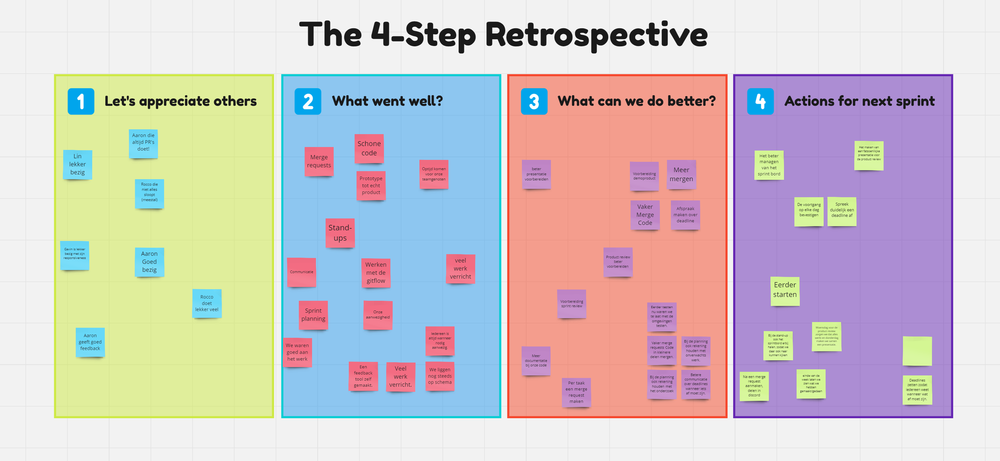

# Retrospective Sprint 2

## Miro bord:

[Miro bord link](https://miro.com/welcomeonboard/aXJ5SFVUS1h4WEE5aE1VeGpwSXdOaDE5YWozS2k0azljOTRTbGFPeDJ0eWJUbEFxUHdUYTU2WW1weEZvWUxMRnwzNDU4NzY0NTgyNDIyMTA5ODUyfDI=?share_link_id=489192721111)

## Actiepunten afgelopen sprint:

- [UX van MVP optimaliseren](https://gitlab.fdmci.hva.nl/propedeuse-hbo-ict/onderwijs/2023-2024/out-b-se-bim/blok-4/caaruujuuwoo65/-/issues/116)
    - **Status:** Gedaan
    - **Actie:** Prototype van winkelwagen afgemaakt in Figma. en feedback gevraagd. meer
      info [hier](https://caaruujuuwoo65-propedeuse-hbo-ict-onderwijs-2023-856b9a79d9a1ec.dev.hihva.nl/personal-documents/rocco/toelichting-k5-en-k2/)
- [Onderzoek naar Performance Optimalisatie Tools in Spring Boot](https://gitlab.fdmci.hva.nl/propedeuse-hbo-ict/onderwijs/2023-2024/out-b-se-bim/blok-4/caaruujuuwoo65/-/issues/117)
    - **Status:** Wordt aan gewerkt
    - **Oorzaak niet afgerond:** Door tijdgebrek niet aan toegekomen.
    - **Actie volgende sprint:** Om dit volgende sprint af te kunnen ronden, ga ik bij de sprintplanning tijd
      inplannen om hieraan te werken.
    - **Actie:** Onderzoek gedaan naar verschillende tools en libraries die performance optimalisatie kunnen
      bieden voor Spring
      Boot. [Meer info](https://gitlab.fdmci.hva.nl/propedeuse-hbo-ict/onderwijs/2023-2024/out-b-se-bim/blok-4/caaruujuuwoo65/-/issues/117)
- [Implementatie van Unit Tests en End-to-End Testing](https://gitlab.fdmci.hva.nl/propedeuse-hbo-ict/onderwijs/2023-2024/out-b-se-bim/blok-4/caaruujuuwoo65/-/issues/118)
    - **Status:** Wordt aan gewerkt
    - **Oorzaak niet afgerond:** We zijn begonnen, maar door tijdgebrek heb ik dit niet kunnen afronden.
    - **Actie:** Om ervoor te zorgen dat ik dit volgende sprint wel kan afronden, ga ik bij de sprintplanning
      de tijd die ik hiervoor nog nodig heb inplannen.
    - **Actie volgende sprint:** Hier zijn we mee begonnen door het maken van een UNIT test in springboot.
      Volgende sprint gaan we hiermee
      verder [Meer info](https://gitlab.fdmci.hva.nl/propedeuse-hbo-ict/onderwijs/2023-2024/out-b-se-bim/blok-4/caaruujuuwoo65/-/issues/118)

## Actiepunten volgende sprint:

Om mee te starten ga ik werken aan de actiepunten die ik afgelopen sprint niet heb kunnen afronden.

- [Meer frequent code laten reviewen](https://gitlab.fdmci.hva.nl/propedeuse-hbo-ict/onderwijs/2023-2024/out-b-se-bim/blok-4/caaruujuuwoo65/-/issues/120)
    - **Status:** Nog niet gestart
    - **Actie:** Ik ga proberen om meer code te laten reviewen door mijn teamgenoten. Dit zal ik doen door
      vaker mijn code te pushen naar de gitlab repository en mijn teamgenoten te vragen om feedback. Hiervoor
      heb een learning story gemaakt.

