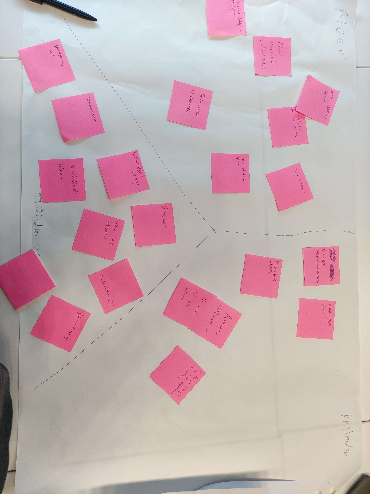

# Retro sprint 1.

Vandaag hebben we de retro gehad van sprint 1 hierbij hebben we terug gekeken naar de afgelopen sprint,
leerdoelen gereflecteerd en nieuwe leerdoelen gemaakt. Ook hebben we direct onze sprint plannen gemaakt voor
de aankomende sprint.

## Reflectie leerdoelen sprint 1

Mijn leerdoelen van sprint 1 waren:

1. In de eerste sprint zal ik een desktop-prototype van een functionele winkelwagen, ontwerpen in Figma. Dit
   doe ik door feedback te vragen op mijn ontwerp tijdens teammeetings.
2. Binnen de eerste sprint leer ik hoe ik de basisstructuur kan opzetten voor een project,
   gebruikmakend van Typescript LIT voor de frontend en Spring Boot met Java, Gradle, en Kotlin voor de
   backend.

Hiervoor heb ik 2 STARR's gemaakt. Die zijn hier te vinden:

[Link STARR Figma leerdoel 1](https://caaruujuuwoo65-propedeuse-hbo-ict-onderwijs-2023-856b9a79d9a1ec.dev.hihva.nl/personal-documents/rocco/sprint1/figma-card-starr/)

[Link STARR Setup leerdoel 2](https://caaruujuuwoo65-propedeuse-hbo-ict-onderwijs-2023-856b9a79d9a1ec.dev.hihva.nl/personal-documents/rocco/sprint1/setup-ts-java-starr/)

## Verwijzingen

### Leerdoelen sprint 2
Voor de aankomende sprint heb ik ook een paar eigen leerdoelen gemaakt.
1. [Verdiepen in UX voor het MVP (Minimum Viable Product)](https://gitlab.fdmci.hva.nl/propedeuse-hbo-ict/onderwijs/2023-2024/out-b-se-bim/blok-4/caaruujuuwoo65/-/issues/116)
2. [Onderzoek naar Performance Optimalisatie Tools in Spring Boot](https://gitlab.fdmci.hva.nl/propedeuse-hbo-ict/onderwijs/2023-2024/out-b-se-bim/blok-4/caaruujuuwoo65/-/issues/117)
3. [Implementatie van Unit Tests en End-to-End Testing](https://gitlab.fdmci.hva.nl/propedeuse-hbo-ict/onderwijs/2023-2024/out-b-se-bim/blok-4/caaruujuuwoo65/-/issues/118)

### Samenwerkingscontract

Wij hebben aan het begin van sprint 1 als team een Samenwerkingscontract gemaakt.
[Link Samenwerkingscontract](https://caaruujuuwoo65-propedeuse-hbo-ict-onderwijs-2023-856b9a79d9a1ec.dev.hihva.nl/teamfiles/samenwerkingscontract/)

### Sprintplanning sprint 2

Na de productreview op vrijdag 26/04/2024 hebben we de sprintplanning gemaakt voor de aankomende sprint.
Bij de sprintplanning hebben we direct de feedback punten uit de productreview meegenomen en hier nieuwe user
story's voor gemaakt zodat die meteen in de aankomende sprint opgepakt kunnen worden. 

De sprintplanning:
[Link Sprintplanning](https://gitlab.fdmci.hva.nl/propedeuse-hbo-ict/onderwijs/2023-2024/out-b-se-bim/blok-4/caaruujuuwoo65/-/milestones/2#tab-issues)