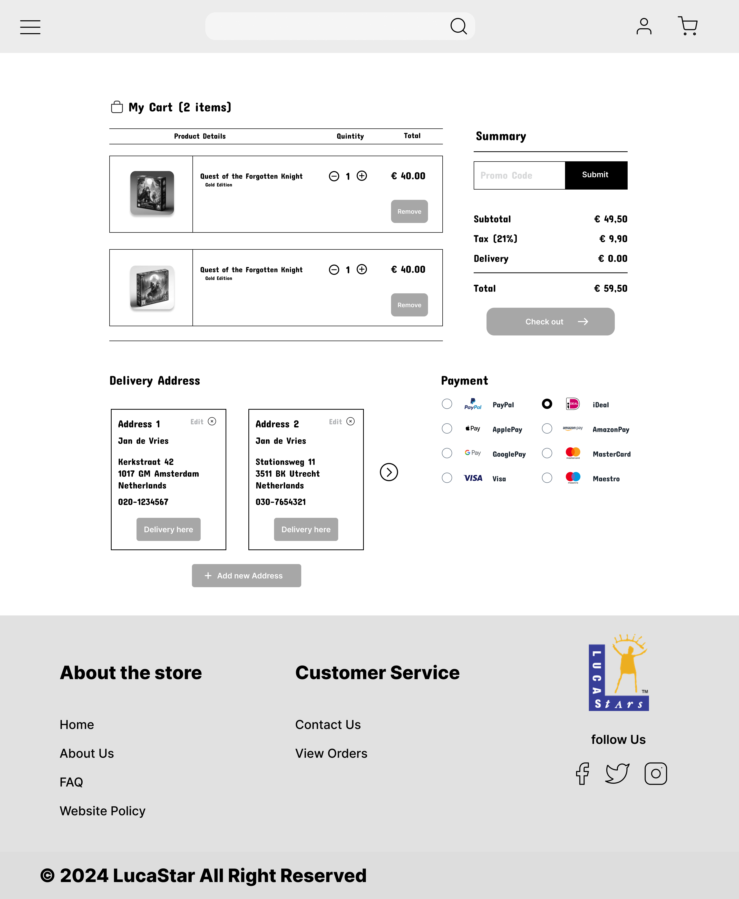

# Toelichting Kwaliteitscriteria 2 & 5

Tijdens Sprint 1 hebben we verschillende prototypes van de webshoppagina's voor Luka Stars gemaakt. We
begonnen met low-fi ontwerpen om de basis vast te leggen. Na het verzamelen van feedback via Google
Formulieren zijn we verdergegaan met het maken van mid-fi prototypes. Ook voor deze ontwerpen hebben we
opnieuw feedback gevraagd, steeds met behulp van Google Formulieren. De pagina die ik heb ontworpen en
waarvoor ik feedback heb opgehaald, is de shopping-cart pagina. Deze prototypes hebben we in Figma gemaakt.

## Inhoudsopgave

1. [Fase 1: Verwachtingen en Low-fi Ontwerpen](#fase-1-verwachtingen-en-low-fi-ontwerpen)
    1. [Feedbackronde 1: Verwachtingen](#feedbackronde-1-verwachtingen)
    2. [Low-fi Ontwerpen](#low-fi-ontwerpen)
2. [Fase 2: Low/Mid-fi Prototypes](#fase-2-lowmid-fi-prototypes)
    1. [Feedbackronde 2: Low/Mid-fi Prototypes](#feedbackronde-2-lowmid-fi-prototypes)
3. [Fase 3: Verbeterde Mid-fi Prototypes](#fase-3-verbeterde-mid-fi-prototypes)
    1. [Feedbackronde 3: Verbeterde Mid-fi Prototypes](#feedbackronde-3-verbeterde-mid-fi-prototypes)
4. [Conclusie](#conclusie)

## Fase 1: Verwachtingen en Low-fi Ontwerpen

### Feedbackronde 1: Verwachtingen

Voordat we met de low-fi ontwerpen begonnen, hebben we eerst feedback opgehaald over wat mensen van de webshop
verwachten. Dit hebben we gedaan door een Google Formulier te maken met vragen over hun verwachtingen van de
soort webshop die wij willen maken. Deze feedback gaf ons waardevolle inzichten en hielp ons bij het vormgeven
van onze eerste ontwerpen.

De ruwe data van deze feedback is verzameld in een spreadsheet. Twee afbeeldingen van het formulier en de
spreadsheet zijn hieronder weergegeven:

### Low-fi Ontwerpen

Op basis van de verzamelde feedback hebben we een low-fi ontwerp gemaakt. Eén persoon uit het team heeft een
basisontwerp gemaakt voor alle pagina's, zodat alles dezelfde stijl heeft en er geen grote verschillen tussen
de pagina's zijn die voor onrust kunnen zorgen. Dit ontwerp werd in Figma gemaakt en diende als uitgangspunt
voor de verdere ontwikkeling.

Hier is opnieuw de ruwe data verzameld in een spreadsheet. Twee afbeeldingen van het formulier en de
spreadsheet zijn hieronder weergegeven:

Vervolgens heb ik specifiek feedback gevraagd over deze pagina. Dit hielp mij om de basis van de shopping-cart
pagina goed neer te zetten. De
feedback heb ik opgehaald in Google Formulieren en de ruwe data is verzameld in een spreadsheet. Twee
afbeeldingen van het formulier en de spreadsheet zijn hieronder weergegeven:

## Fase 2: Low/Mid-fi Prototypes

Met de feedback op de low-fi ontwerpen zijn we verdergegaan met het maken van mid-fi prototypes. Deze
prototypes boden een gedetailleerder en realistischer beeld van het uiteindelijke ontwerp. Hierbij heb ik het
prototype van de shopping-cart pagina verder uitgewerkt.

### Feedbackronde 2: Low/Mid-fi Prototypes

De feedback op de Low/Mid-fi prototypes hebben we als team verzameld via Google Formulieren, waarbij we alle
pagina's onder de loep hebben genomen. De feedback op de Low/Mid-fi shopping cart was realistischer en minder
positief, waardoor de beslissing is genomen om aanzienlijke veranderingen door te voeren op basis van de
feedback.

Ook hier is weer de ruwe data verzameld in een spreadsheet. Twee afbeeldingen van het formulier en de
spreadsheet zijn hieronder weergegeven:

## Fase 3: Verbeterde Mid-fi Prototypes

Na de veranderingen gebaseerd op de feedback op de Low/Mid-fi prototypes, heb ik nieuwe designs gemaakt voor
een
verbeterd Mid-fi prototype. Deze aanpassingen waren nodig om aan de verwachtingen te voldoen.

### Feedbackronde 3: Verbeterde Mid-fi Prototypes

Voor de verbeterde mid-fi prototypes heb ik opnieuw feedback gevraagd via Google Formulieren. We zijn nog
bezig met het verzamelen van de laatste feedbackpunten op deze formulieren:

## Conclusie

Tijdens de ontwerpperiode hebben we waardevolle inzichten opgedaan door middel van meerdere feedbackrondes en
iteratieve ontwerpen voor de webshoppagina's van Luka Stars. Wat ik het belangrijkste heb geleerd, is het
belang van voortdurend feedback vragen. Eén keer feedback vragen is nooit genoeg om een solide en
gebruiksvriendelijke oplossing te garanderen.

Onze eerste feedbackronde leverde voornamelijk positieve reacties op, wat ons aanvankelijk vertrouwen gaf.
Maar toen we naar meer concretere prototypes gingen, veranderde de feedback drastisch en werd veel
kritischer. Deze 180-graden verandering toonde aan dat gebruikers pas echt zinvolle feedback kunnen geven
wanneer ze een gedetailleerder prototype zien.

Deze ervaring heeft mij geleerd dat het proces van ontwerpen en herhaaldelijk feedback vragen
noodzakelijk is voor een goed eindproduct. Door continu in dialoog te blijven met gebruikers, kunnen we
ervoor zorgen dat onze ontwerpen niet alleen visueel aantrekkelijk zijn, maar ook functioneel en
gebruiksvriendelijk.